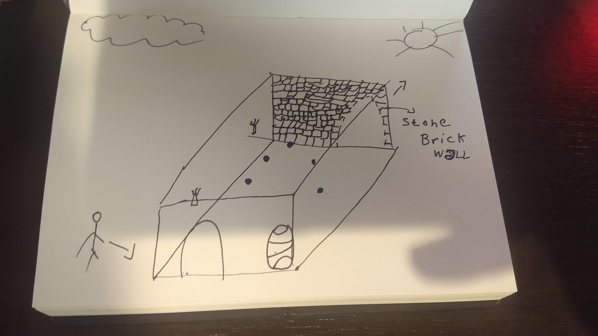
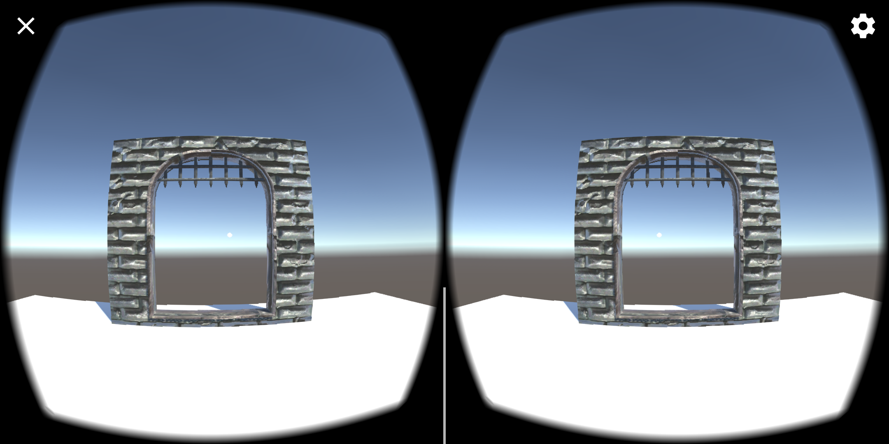
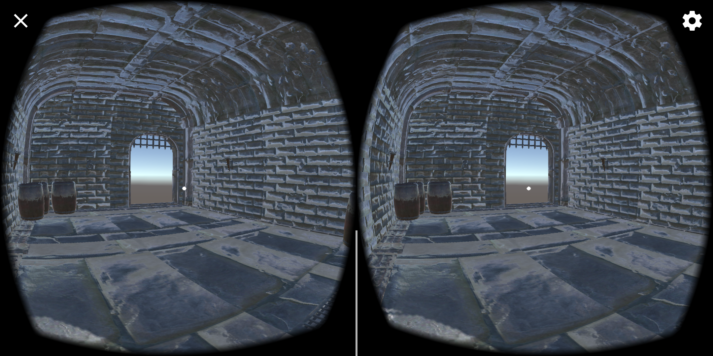
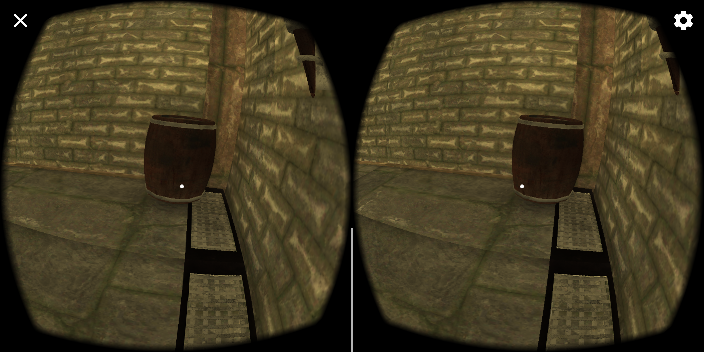
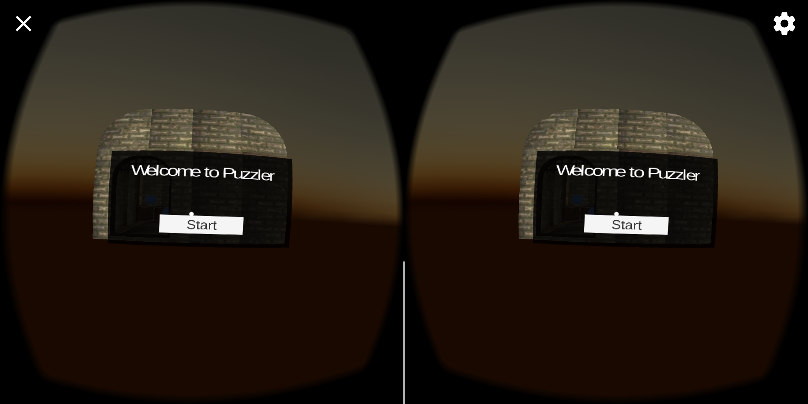
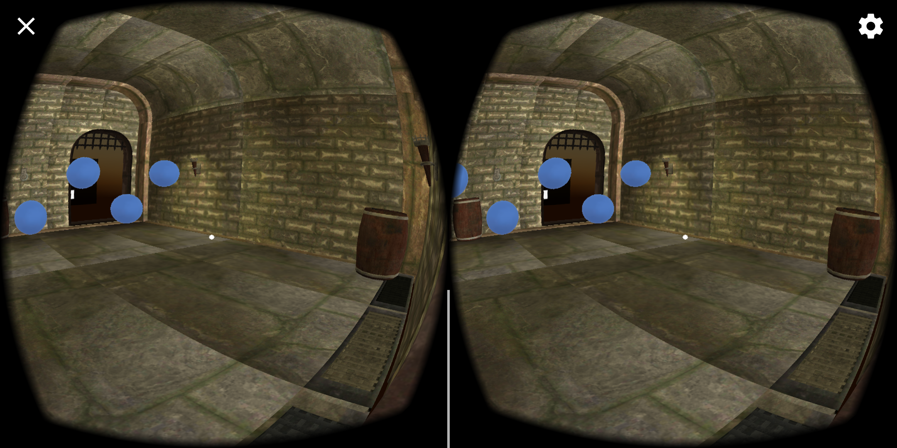
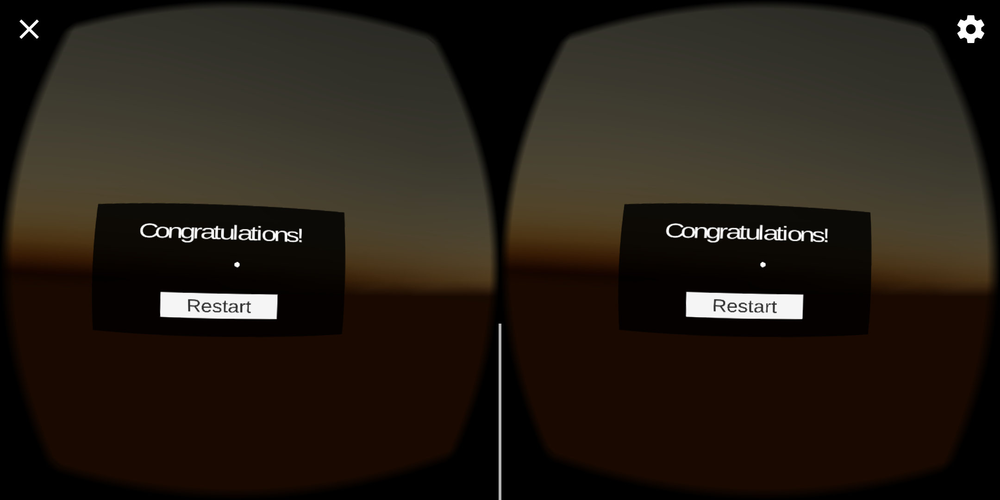

# Puzzler

# Introduction
Puzzler is a mobile VR app with a simon says like puzzle that gives the opportunity for anyone to experience virtual reality.

## Target audience
The person who will use this app could be in any range of age. Since it's a rather simple app, it can be used to show what's Virtual Reality like and how to interact with a virtual world. So it should consider older people not being able to move too much.

## Persona
Ana - 82 y.o. - Retired - "Everyone is looking to their smartphones and not to the world!"

Ana is a retired lady that previously worked as a dentist. She doesn't like tecnology and doesn't agree with the way it is eating our world, she also refuses to try it out any new devices. She has a grandson that loves tech and is amazed by how awesome a VR experience can be. She love playing puzzle games to pass her time, like crosswords, rubiks cube and sudoku.

VR Experience: No

<!-- # Outcomes -->

# Story of the process
At first I've drawn a sketch to "make it real" what I had in my mind. The objective wasn't a perfect picture of the final result, but a simple drawing that I could use to pass the message of what the puzzler would be in the end. As you can see, some things changed in the process of making, like the removal of the sun and clouds.

## Iteration #1:
This was the first Build. The intention of this build was to get the door scaled correctly, a really important point when working in VR. Luckily I got it first try by making the camera height the same as my height and using it as the starting point.

## Iteration #2:
After, in the second iteration, I built the initial room using the scaled door as a source, and then and checked if everything was working and scaled as expected.  

## Iteration #3 (10/31/2018):
In this build, I needed to check if the orbs scaling was correct. In the previous iteration I felt that the game was a bit slow on my hardware(moto z3 play), so I checked every object as static and changed its material to Mobile->Diffuse, because of this change the sewer metal turned black at first, but after some build it came back to normal. I guess I just had to wait it bake correctly.

I also took the opportunity to add the torches' light and set the mood in the scene.

## Iteration #4 (05/01/2019):
After some time I got back to the project. Between the previous iteration and this one I had set up a start/reset menu UI and user tested it so it wouldn't seem too big. Now I added the movement system that takes place when we start and finish the game.

I don't have an user to test if it is giving motion sickness, so I did test with myself. The movements are fine and there's no motion sickness at all. The speeds are reasonably low so it is probably okay to most users. Might have to check it out again after if I get the chance to test with someone.

[Video](fourth_iteration-video.mp4)

## Final iteration. #5:
Added the finishing touches. In this iteration I've finished adding the game logic and the user feedback, suck as visual and audio feedbacks.

[Video](fifth_iteration-video.mp4)

## User Testing:
To user test I've used the following checklist of questions:
- How does the size of everything feel? Which size do you think you character is?
- Is it comfortable?
- What is the mood of the scene?

User tests result:
Tested with 1 user:
- How does the size of everything feel? Which size do you think you character is?  
    > Normal, it feels like I'm there

- Is it comfortable?
    > The image feels a bit duplicated

- What is the mood of the scene?
    > Dark, like in a bad place.

- Where do you think you are?
    > In a wine house, maybe in a castle.

<!-- ## Final piece -->

# Conclusion
A lot of design was put in this project, even though it is not a full fledged game. You have to account for scale, user input and feedback, how it'll perceive motion/sim sickness, if the mood is correct with what you're targeting, and if the game is understandable enough to your target audience. In that regard, even though I couldn't user test the final builds, I had lots of fun and I think the project is a great success!